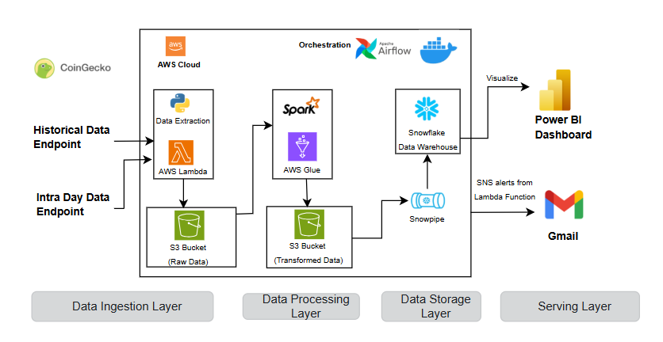

# Scalable Crypto Data Engineering Pipeline
## Project Overview

End-to-end pipeline for ingesting, transforming, and storing real-time and historical cryptocurrency market data to enable reliable analytics and downstream workflows.

### Data Processing Streams
The pipeline is architected to handle two distinct data frequencies, ensuring both deep historical context and real-time market awareness.
1. **Historical Data Pipeline:** This is a manual, one-time (or occasional) process designed to build your baseline dataset
2. **Intra-day Data Pipeline:** It is automated, runs every 6 hours and only fetches the latest data.

## Architecture Diagram



## Solution Stack

**Implemented architecture using**:
* AWS Lambda for scalable ingestion of crypto market data
* AWS Glue (PySpark) for structured transformation logic
* S3 for durable data storage layers
* Snowflake for warehousing and query-optimized storage
* Apache Airflow to orchestrate workflows
* GitHub Actions + Docker for automated testing and deployment

## Project Structure

```text
Scalable_Crypto_Data_Engineering_Pipeline/
└── .github/
  └── workflows/
    └── deploy_lambda_glue.yml
└── dags/
  └── crypto_historical_data_dag.py
  └── crypto_intra_day_dag.py
└── glue_jobs/
  └── historical_data_transformation.py
  └── intra_day_transformation.py
└── lambda_function/
  └── ingestion.py
└── snowflake_scripts/
  └── 1_creation_tables.sql
  └── 2_creating_pipe_for_historical.sql
  └── 3_creating_pipe_for_intra_day.sql
  └── 4_inspection.sq;
└── tests/ 
  └── test.py
└── .gitignore
└── README.md
└── docker-compose.yaml
└── requirements.txt
```

## Pipeline Workflow

**Pipeline stages**:
1. **Extract**: Scheduled API calls retrieve fresh cryptocurrency prices from CoinGecko.
2. **Transform**: JSON data is normalized, timestamped, cleansed, and structured for analytics.
3. **Load**: Processed data is loaded incrementally into the historical price tables in Snowflake for efficient querying.

## S3 Structure

```text
s3://crypto-raw-data-0704/
├── historical_data/
└── intra_day/

s3://crypto-transformed-data-0704/
├── historical_data/
└── intra_day/
```

## Testing

**Automated tests include**:
  * API reachability validation against CoinGecko
  * Verification of required S3 bucket provisioning
  * Sanity checks for Glue transformation scripts
  * Alerts validation via AWS SNS

## Installation & Setup

Follow these high-level steps to replicate the environment and deploy the pipeline.

### 1. Prerequisites

* AWS Account (Can be free tier also)
* Snowflake Account
* Python ≥ 3.9
* Docker & Docker Compose
* AWS CLI configured (with access keys and default region)
* GitHub repository connected
* CoinGecko API Key (Get yours now: https://www.coingecko.com/en/api)

### 2. AWS Infrastructure Setup

* CLI Configuration: Configure the AWS CLI with appropriate regional and access credentials.
* Storage (S3): Create raw and transformed data buckets for historical and intraday data.
* Identity & Access Management (IAM): Provision roles with specific permissions for Lambda and AWS Glue.
* Compute: Deploy the Lambda data-fetcher and upload PySpark scripts to the Glue environment.

### 3. Snowflake Data Warehouse

* Account Provisioning: Create the database, schema, and virtual warehouse.
* Access Control: Configure users and roles with appropriate security privileges.
* Data Ingestion: Configure Snowpipe to automate data loading from the AWS S3 transformed bucket.

### 4. Airflow Orchestration

* Environment: Initialize Airflow using Docker Compose for containerized management.
* External Connections: Configure the following integration providers in the Airflow UI:
    * AWS: For managing Glue and Lambda triggers.
    * Snowflake: For data warehouse operations and monitoring.

### 5. CI/CD Pipeline

* GitHub Actions: Ensure the workflow triggers are active to automate deployments whenever changes are pushed to:

    * lambda_function/
    * glue_jobs/
    * dags/

##  Notes
* Snowpipe cannot overwrite; truncation must be handled manually or via DAG before ingestion
